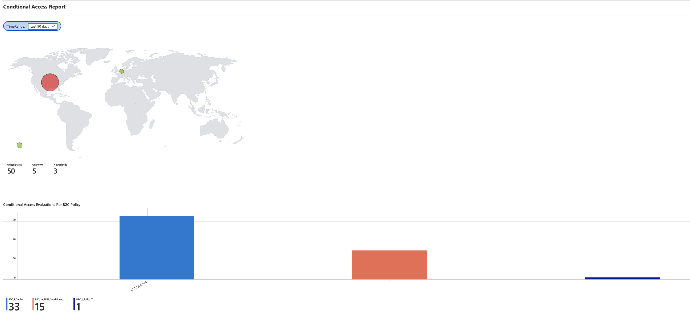
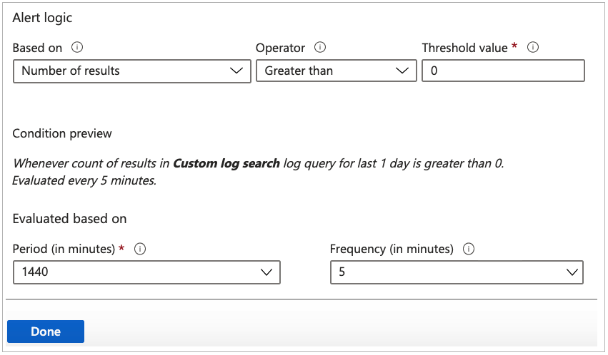
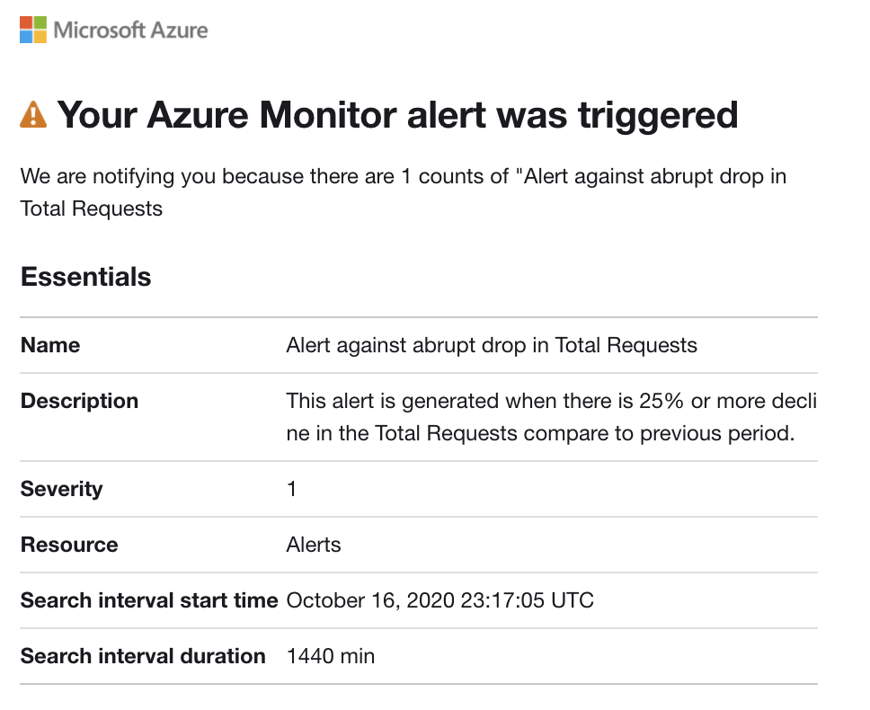

# Azure AD B2C Reports & Alerts 

In this repo, you will find samples for Azure AD B2C reporting and alerts created using Azure Monitor.

## Getting Started

- Read about [Audit Logs](https://docs.microsoft.com/en-us/azure/active-directory-b2c/view-audit-logs) and [SignIn Logs](https://docs.microsoft.com/en-us/azure/active-directory/reports-monitoring/reference-azure-monitor-sign-ins-log-schema) to gain better understanding about their usage and schema.

- Read about [Azure Monitor](https://docs.microsoft.com/en-us/azure/azure-monitor/overview) to understand its key features.

- Read about [Azure Active Directory reporting latencies](https://docs.microsoft.com/en-us/azure/active-directory/reports-monitoring/reference-reports-latencies) and [Log data ingestion time in Azure Monitor](https://docs.microsoft.com/en-us/azure/azure-monitor/platform/data-ingestion-time) which covers various latencies across Azure AD B2C and Azure Monitor. 

- Read about [Log Analytics Queries](https://docs.microsoft.com/en-us/azure/azure-monitor/log-query/get-started-portal) to understand how to create and run reports using [Kusto](https://docs.microsoft.com/en-us/azure/data-explorer/kusto/concepts/) language.

- Read about [Azure Monitor Workbooks](https://docs.microsoft.com/en-us/azure/azure-monitor/platform/workbooks-overview) which provides a flexible canvas for data analysis and the creation of rich visual reports. 

- Read about [Azure Alerts](https://docs.microsoft.com/en-us/azure/azure-monitor/platform/alerts-overview) their benefits and usage patterns.

## Prerequisites

- You will require to create an Azure AD B2C directory, see the guidance [here](https://docs.microsoft.com/en-us/azure/active-directory-b2c/tutorial-create-tenant).

- To use the sample artifacts in this repo, follow the instructions described in the [Monitor Azure AD B2C with Azure Monitor
](https://docs.microsoft.com/en-us/azure/active-directory-b2c/azure-monitor
) to setup Azure Monitor to route sign-in and auditing logs to Log Analytics workspace. After the setup is complete, it may take up to 45 minutes or so for logs to show up in Log Analytics workspace. Subsequently, Azure monitor will sync the logs within few minutes as they get generated by Azure AD B2C.  


## Workbooks

All the reports in this repo are based on [Azure Monitor Workbooks](https://docs.microsoft.com/en-us/azure/azure-monitor/platform/workbooks-overview) which provide a flexible canvas for data analysis and the creation of rich visual reports within the Azure portal. 

The [Workbooks](workbooks) folder within this repo contains four workbooks in the standard JSON Gallery Template format. You can use the following instructions to import the JSON to create a new workbook. Please note that you need to repeat these steps for all workbooks. 

- [Dashboard](workbooks/dashboard.json) 
- [MFA](workbooks/mfa-operations.json) 
- [Conditional Access](workbooks/ca-report.json)
- [Search by CorrelationId](workbooks/search-by-correlationid.json)

The Azure AD B2C [Dashboard](workbooks/dashboard.json) workbook provides various reports related to **User Insights** and **Authentications** for Azure AD B2C Tenant.

1. From **Log Analytics workspace** select **Workbooks**.
1. From the toolbar, select **+ New** option to create a new workbook.
1. On the **New workbook** page, select the **Advanced Editor** using the **</>** option on the toolbar.

     

1. Select **Gallery Template**.
1. Replace the JSON in the **Gallery Template**  with the content [Azure AD B2C basic workbook](https://TBD):
1. Apply the template by using the **Apply** button.
1. Select **Done Editing** button from the toolbar to finish editing of the workbook.
1. Finally, save the workbook by using the **Save** button from the toolbar.
1. Provide a **Title** such as, *Azure AD B2C Dashboard*. 
1. Select **Save**.
     

The workbook will display reports in the form of a dashboard.

### Azure AD B2C Dashboard

- User Insights
    - Platform
    - Browser
    - Location

    

- Authentications
    - Authentications Per Applications
    - Authentications Per Identity Provider
    - Authentications Per Policy
    - Authentications Failure Reasons
    - Failed Sign-Ins (Timechart)
    - Successful Sign-Ins (Timechart)

    
    
    

### Multifactor Authentications (MFA) Operations 

[MFA](workbook/mfa-operations) workbook provides summary of successful and failed MFA operations throughout Azure AD B2C Tenant.

- MFA Operations
    - Summary of MFA operations (success, failed, client error)
    - MFA operations per Azure AD B2C Policy
    - Details of Successful MFA Operations 
    - Details of UnSuccessful MFA Operations 

     
     
     

### Conditional Access Report

[MFA](workbook/ca-report) workbook provides details related to Condtional Access within Azure AD B2C tenant.

   
> **NOTE**: This report requires Azure AD B2C Conditional Access to be enabled on Azure AD B2C. For more information, please read [Add Conditional Access to user flows in Azure Active Directory B2C](https://docs.microsoft.com/en-us/azure/active-directory-b2c/conditional-access-user-flow) and [Define a Conditional Access technical profile in an Azure Active Directory B2C custom policy](https://docs.microsoft.com/en-us/azure/active-directory-b2c/conditional-access-technical-profile)
     
- Conditional Access Report
    - Location (Based on user request to B2C policy/user flow which results in Condtional Access evaluation)
    - Conditional Access Evaluations Per B2C Policy
    - Conditional Access Evaluations (all relevant operations)
    - Details (of a particular Conditional Access Evaluation. Click on a row item within the Condtional Access Evaulation to view an operation details) 

    
    
 
### Search by CorrelationId

The [Search by CorrelationId](workbook/search-by-correlationid.json) workbook allows you to search Sign-In and Audit Logs against a particular correlation id. This is helpful when you are trying to troubleshoot a particular issue and want to filter based on a correlation id across both logs.

  
    
 
## Alerts

Alerts are created by alert rules in Azure Monitor and can automatically run saved queries or custom log searches at regular intervals. You can create alerts based on specific performance metrics or when certain events are created, absence of an event, or a number of events are created within a particular time window. For example, alerts can be used to notify you when average number of sign-in exceeds a certain threshold. For more information, see Create alerts.

Use the following instructions to create a new **Azure Alert which will send an email notification whenever there is a 25% drop in the Total Requests compare to previous period. Alert will run every 5 minutes and look for the drop within last 24 hours windows**. The alerts are created using Kusto query language.

 - From Log Analytics workspace, select Logs.
 - Create a new Kusto query by using the query below.

    ```kusto
    let start = ago(24h);
    let end = now();
    let threshold = -25; //25% decrease in total requests.
    AuditLogs
    | serialize TimeGenerated, CorrelationId, Result
    | make-series TotalRequests=dcount(CorrelationId) on TimeGenerated in range(start, end, 1h)
    | mvexpand TimeGenerated, TotalRequests
    | serialize TotalRequests, TimeGenerated, TimeGeneratedFormatted=format_datetime(todatetime(TimeGenerated), 'yyyy-M-dd [hh:mm:ss tt]')
    | project   TimeGeneratedFormatted, TotalRequests, PercentageChange= ((toreal(TotalRequests) - toreal(prev(TotalRequests,1)))/toreal(prev(TotalRequests,1)))*100
    | order by TimeGeneratedFormatted
    | where PercentageChange <= threshold
    ```

 - Select **Run**, to test the query. You should see the results if there is a drop of 25% or more in the total requests within the past 24 hours.
 - To create an alert rule based on the query above, use the **+ New alert rule** option available in the toolbar.
 - On the **Create a alert rule** page, select **Condition name** 
 - On the **Configure signal logic** page, set following values and then use **Done** button to save the changes.
    * Alert logic: Set **Number of results** **Greater than** **0** .
    * Evaluation based on: Select **1440** for Period (in minutes) and **5** for Frequency (in minutes) 

    

After the alert is created, go to **Log Analytics workspace** and select **Alerts**. This page displays all the alerts that have been triggered in the duration set by **Time range** option.  

### Configure action groups

Azure Monitor and Service Health alerts use action groups to notify users that an alert has been triggered. You can include sending a voice call, SMS, email; or triggering various types of automated actions. Follow the guidance [Create and manage action groups in the Azure portal](https://docs.microsoft.com/en-us/azure/azure-monitor/platform/action-groups)

Here is an example of an alert notification email. 

   

## FAQ

- How do I know Azure AD B2C logs are available in Logs Analytics workspace?

  Azure AD B2C Audit and Sign-In Logs shows up in the LogManagement console as shown below.
  
  

- Why my reports are not able to show data beyond past 30 days?

  By default Logs Analytics workspace only retain data for 30 days. You can change the retention period by using the instructions provided [here](https://docs.microsoft.com/en-us/azure/azure-monitor/platform/manage-cost-storage#change-the-data-retention-period)
  
- Can I display application name instead of application object id in the reports?
    
    Currently, application object id is the only value that is available within the Azure AD B2C logs.  


